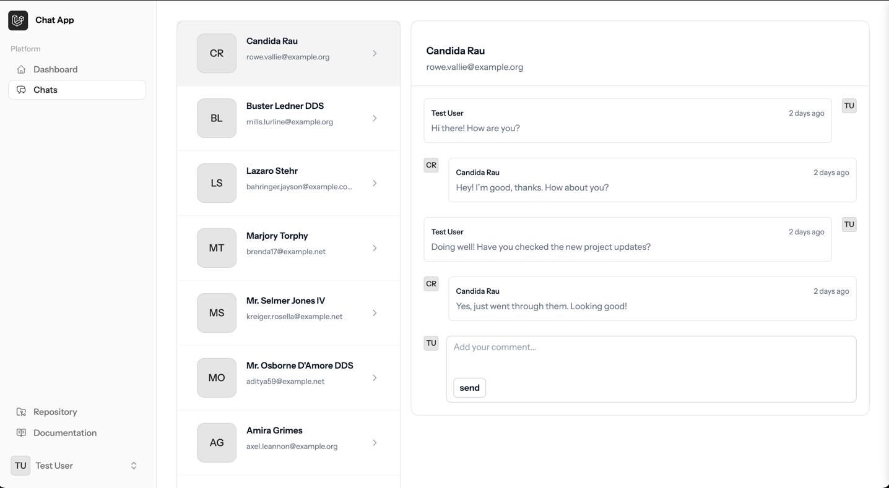
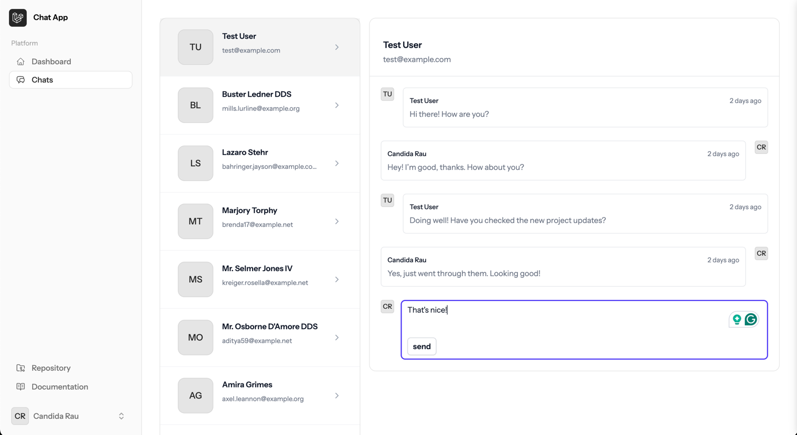

# 📬 Messenger Reverb App

A real-time messaging application built with **Laravel 12**, **Tailwind CSS**, and **Laravel Reverb**. This project demonstrates a seamless chat experience with real-time updates and a modern UI.

---

## 🚀 **Features**

- Real-time messaging with Laravel Reverb
- User authentication and authorization
- Typing indicators and read receipts
- Chat threads with multiple users
- Message timestamps and formatting
- Laravel Event Broadcasting for live updates

---

## 🛠️ **Tech Stack**

- **Backend:** Laravel 12
- **Frontend:** Tailwind CSS
- **Real-Time Communication:** Laravel Reverb
- **Database:** MySQL

---

## ⚙️ **Installation Instructions**

1. **Clone the repository:**
    ```bash
    git clone git@github.com:PoojaJadav/messanger.reverb.git
    cd messanger.reverb
    ```

2. **Install dependencies:**
    ```bash
    composer install
    npm install && npm run dev
    ```

3. **Set up environment variables:**
    ```bash
    cp .env.example .env
    php artisan key:generate
    ```

4. **Configure the database:**
    - Update `.env` with your database credentials.
    - Run migrations:
    ```bash
    php artisan migrate
    ```

5. **Run the application:**
    ```bash
    php artisan serve
    ```
   Visit [http://127.0.0.1:8000](http://127.0.0.1:8000) in your browser.

---

## 🔄 **Real-Time Messaging with Laravel Reverb**

This application uses **Laravel Reverb** for real-time communication.

### **1️⃣ Install Reverb:**
Run the following command to install broadcasting and Reverb:
```bash
php artisan install:broadcasting
```

### **2️⃣ Configure Environment Variables**
In your `.env` file, configure the Reverb settings:
```env
BROADCAST_CONNECTION=reverb

REVERB_APP_ID=your-app-id
REVERB_APP_KEY=your-app-key
REVERB_APP_SECRET=your-app-secret
REVERB_HOST=127.0.0.1
REVERB_PORT=8080
REVERB_SCHEME=http

VITE_REVERB_APP_KEY="${REVERB_APP_KEY}"
VITE_REVERB_HOST="${REVERB_HOST}"
VITE_REVERB_PORT="${REVERB_PORT}"
VITE_REVERB_SCHEME="${REVERB_SCHEME}"
```

### **3️⃣ Start the Reverb Server**
To start the Reverb WebSocket server:
```bash
php artisan reverb:start
```

If you want to specify a different host or port:
```bash
php artisan reverb:start --host=127.0.0.1 --port=9000
```

---

## 📝 **Usage**

1. Register or log in to your account.
2. Navigate to the **Chat** tab.
3. Select a user from the list to start chatting.
4. Send and receive messages in real-time.

---

## ✨ **UI Preview**

### 💬 Chat View


### ✉️ Message Sent

---

## 🤝 **Contributing**

1. Fork the repository
2. Create a new branch (`git checkout -b feature/your-feature`)
3. Commit your changes (`git commit -am 'Add some feature'`)
4. Push to the branch (`git push origin feature/your-feature`)
5. Create a new Pull Request

---

## 📧 **Contact**

For any questions or suggestions, feel free to reach out:
- **LinkedIn:** [PoojaJadav](https://www.linkedin.com/in/pooja-jadav/)
